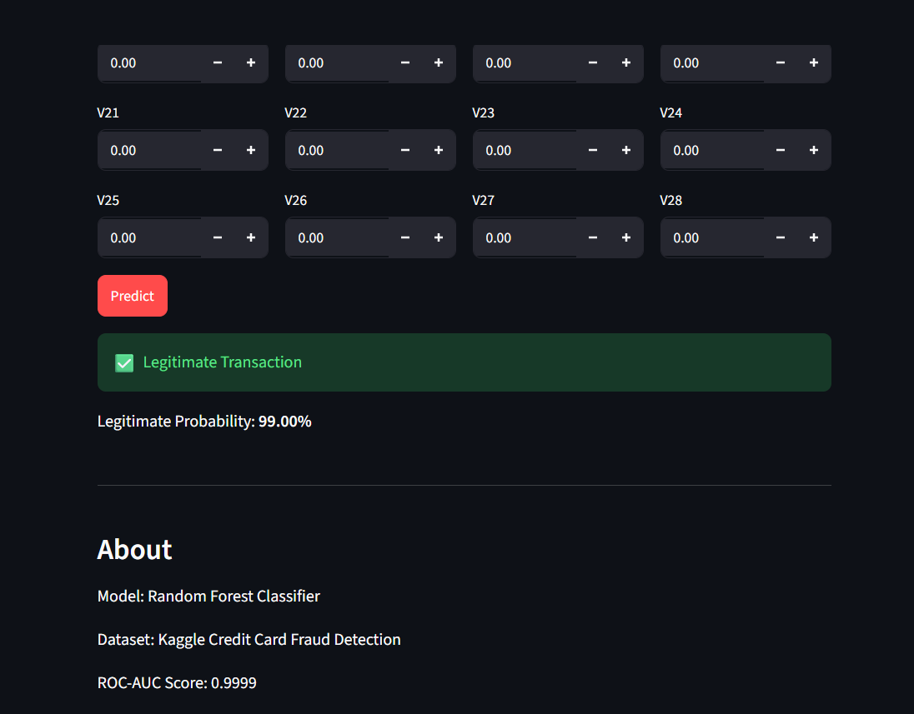
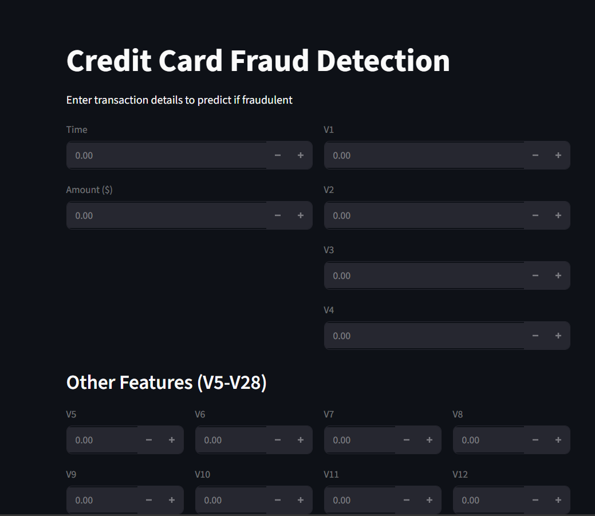
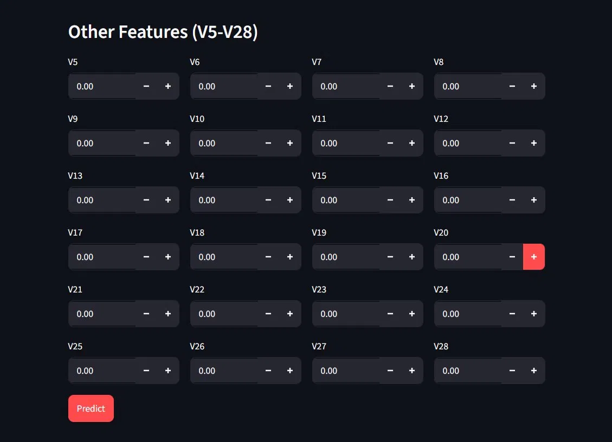

# Credit Card Fraud Detection

A machine learning web app to detect fraudulent credit card transactions using Random Forest classifier.

## Live Demo
[Add Streamlit link here after deployment]

## Screenshots

### App Interface


### Input Features


### Prediction Result


## About
Credit card fraud detection is a classic imbalanced classification problem. This project uses SMOTE to handle class imbalance and Random Forest to classify transactions as fraudulent or legitimate.

## Model Performance
- ROC-AUC Score: 0.9999
- F1-Score: 0.89
- Precision: 1.00
- Recall: 1.00

## Tech Stack
- Python
- Scikit-learn (Random Forest)
- imbalanced-learn (SMOTE)
- Streamlit (Web App)
- Pandas, NumPy, Matplotlib, Seaborn

## How to Run Locally

**1. Clone the repo:**
```bash
git clone https://github.com/ROHIT-25607/credit-card-fraud-detection-using-ML.git
cd credit-card-fraud-detection-using-ML
```

**2. Install dependencies:**
```bash
pip install -r requirements.txt
```

**3. Download dataset:**
Download `creditcard.csv` from [Kaggle](https://www.kaggle.com/datasets/mlg-ulb/creditcardfraud) and place it in the `data/` folder.

**4. Train the model:**
```bash
python train.py
```

**5. Run the app:**
```bash
streamlit run app.py
```

## How it Works
1. Dataset loaded and preprocessed (StandardScaler on Time and Amount)
2. SMOTE applied to handle class imbalance (fraud cases are only 0.17% of data)
3. Random Forest trained on balanced dataset
4. Model saved with joblib
5. Streamlit app loads model and makes real-time predictions